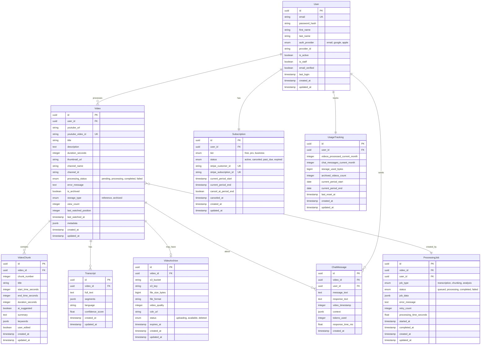

# Entity Relationship Diagram (ERD)
## Video Learning & Creation Platform

This document contains the complete database schema for the Video Learning Platform MVP (Phase 1 - YouTube Processing).

---

## Database Schema Overview

The database is structured around these core entities:
- **Users** - User accounts and authentication
- **Subscriptions** - Payment and subscription management
- **Videos** - Processed YouTube videos
- **VideoChunks** - Smart segments within videos
- **Transcripts** - Video transcription data
- **ChatMessages** - User conversations with videos
- **UsageTracking** - Monitor user activity and limits
- **VideoArchives** - Stored video files

---

## ERD Diagram



---

## Detailed Entity Descriptions

### 1. User Entity

**Purpose:** Store user account information and authentication data

**Key Fields:**
- `id` - UUID primary key
- `email` - Unique email address
- `password_hash` - Hashed password (bcrypt/PBKDF2)
- `auth_provider` - How user signed up (email, google, apple)
- `provider_id` - OAuth provider's user ID
- `email_verified` - Whether email is confirmed

**Relationships:**
- Has many Videos (one-to-many)
- Has many ChatMessages (one-to-many)
- Has one Subscription (one-to-one)
- Has one UsageTracking (one-to-one)

**Indexes:**
- `idx_user_email` on `email`
- `idx_user_provider` on `auth_provider, provider_id`

**Business Rules:**
- Email must be unique
- Provider + provider_id combination must be unique
- Password required only for email auth_provider
- New users get free tier subscription automatically

---

### 2. Subscription Entity

**Purpose:** Manage user subscription tiers and billing

**Key Fields:**
- `id` - UUID primary key
- `user_id` - Foreign key to User
- `tier` - Subscription level (free, pro, business)
- `status` - Current status (active, canceled, past_due, expired)
- `stripe_customer_id` - Stripe customer identifier
- `stripe_subscription_id` - Stripe subscription identifier
- `current_period_start/end` - Billing cycle dates
- `cancel_at_period_end` - Whether to cancel at cycle end

**Relationships:**
- Belongs to one User (many-to-one)

**Indexes:**
- `idx_subscription_user` on `user_id`
- `idx_subscription_stripe_customer` on `stripe_customer_id`
- `idx_subscription_status` on `status`

**Business Rules:**
- Every user must have exactly one subscription
- Free tier users have no stripe_customer_id
- Status must be updated via Stripe webhooks
- Expired subscriptions revert to free tier

---

### 3. Video Entity

**Purpose:** Store processed YouTube video information

**Key Fields:**
- `id` - UUID primary key
- `user_id` - Foreign key to User (who processed it)
- `youtube_url` - Original YouTube URL
- `youtube_video_id` - YouTube's video ID (unique)
- `title` - Video title
- `duration_seconds` - Video length
- `processing_status` - Current processing state
- `is_archived` - Whether video is stored locally
- `storage_type` - Reference (YouTube) or archived (S3)
- `last_watched_position` - Resume playback position
- `metadata` - JSON field for additional data

**Relationships:**
- Belongs to one User (many-to-one)
- Has many VideoChunks (one-to-many)
- Has one Transcript (one-to-one)
- Has many ChatMessages (one-to-many)
- Has one VideoArchive (one-to-one, optional)
- Has many ProcessingJobs (one-to-many)

**Indexes:**
- `idx_video_user` on `user_id`
- `idx_video_youtube_id` on `youtube_video_id`
- `idx_video_status` on `processing_status`
- `idx_video_created` on `created_at DESC`

**Business Rules:**
- Same YouTube video can be processed by multiple users
- youtube_video_id must be extracted from URL
- Duration must be positive
- Archived videos must have corresponding VideoArchive record
- Processing status workflow: pending → processing → completed/failed

---

### 4. VideoChunk Entity

**Purpose:** Store smart segments/chunks within videos

**Key Fields:**
- `id` - UUID primary key
- `video_id` - Foreign key to Video
- `chunk_number` - Sequence number (1, 2, 3...)
- `title` - Descriptive name for chunk
- `start_time_seconds` - When chunk begins
- `end_time_seconds` - When chunk ends
- `ai_suggested` - Whether AI created this chunk
- `summary` - Brief description of chunk content
- `keywords` - JSON array of relevant keywords
- `user_edited` - Whether user modified AI suggestion

**Relationships:**
- Belongs to one Video (many-to-one)

**Indexes:**
- `idx_chunk_video` on `video_id`
- `idx_chunk_number` on `video_id, chunk_number`

**Business Rules:**
- Chunks cannot overlap (end_time of chunk N ≤ start_time of chunk N+1)
- start_time < end_time
- All times must be within video duration
- chunk_number must be sequential starting from 1
- First chunk typically starts at 0
- Last chunk typically ends at video duration

---

### 5. Transcript Entity

**Purpose:** Store video transcription and timing data

**Key Fields:**
- `id` - UUID primary key
- `video_id` - Foreign key to Video
- `full_text` - Complete transcript as text
- `segments` - JSON array of timed segments
- `language` - Detected language code (e.g., 'en', 'es')
- `confidence_score` - Transcription accuracy (0-1)

**Segment Structure (JSON):**
```json
[
  {
    "start": 0.5,
    "end": 3.2,
    "text": "Welcome to this tutorial",
    "confidence": 0.95
  },
  {
    "start": 3.5,
    "end": 7.1,
    "text": "Today we'll learn about Python",
    "confidence": 0.98
  }
]
```

**Relationships:**
- Belongs to one Video (one-to-one)

**Indexes:**
- `idx_transcript_video` on `video_id` (unique)
- `idx_transcript_language` on `language`

**Business Rules:**
- Each video can have only one transcript
- Segments must be in chronological order
- Full_text is concatenation of all segment texts
- Confidence_score is average of all segment confidences

---

### 6. ChatMessage Entity

**Purpose:** Store conversations between users and their videos

**Key Fields:**
- `id` - UUID primary key
- `video_id` - Foreign key to Video
- `user_id` - Foreign key to User
- `message_text` - User's question/input
- `response_text` - AI's response
- `video_timestamp` - Position in video (if relevant)
- `context` - JSON with conversation context
- `tokens_used` - API tokens consumed
- `response_time_ms` - How long AI took to respond

**Context Structure (JSON):**
```json
{
  "previous_messages": 3,
  "transcript_included": true,
  "chunk_context": "chunk_2",
  "model": "gemini-pro"
}
```

**Relationships:**
- Belongs to one Video (many-to-one)
- Belongs to one User (many-to-one)

**Indexes:**
- `idx_chat_video` on `video_id`
- `idx_chat_user` on `user_id`
- `idx_chat_created` on `created_at DESC`

**Business Rules:**
- Messages are immutable (no updates after creation)
- Tokens_used tracked for billing/analytics
- video_timestamp optional (only if question about specific moment)
- Response must not be empty

---

### 7. UsageTracking Entity

**Purpose:** Monitor user activity and enforce limits

**Key Fields:**
- `id` - UUID primary key
- `user_id` - Foreign key to User
- `videos_processed_current_month` - Count of videos this period
- `chat_messages_current_month` - Count of chat messages
- `storage_used_bytes` - Total storage consumed
- `archived_videos_count` - Number of archived videos
- `current_period_start/end` - Tracking period dates
- `last_reset_at` - When counters were last reset

**Relationships:**
- Belongs to one User (one-to-one)

**Indexes:**
- `idx_usage_user` on `user_id` (unique)
- `idx_usage_period` on `current_period_end`

**Business Rules:**
- Counters reset monthly based on user's subscription start date
- Free tier limits: 3 videos, basic features
- Pro tier: Unlimited videos, all features
- Storage calculated from VideoArchive file sizes
- Must check limits before allowing actions

**Reset Logic:**
```python
# Pseudo-code
if today > current_period_end:
    videos_processed_current_month = 0
    chat_messages_current_month = 0
    current_period_start = today
    current_period_end = today + 1 month
    last_reset_at = now
```

---

### 8. VideoArchive Entity

**Purpose:** Manage stored video files (premium feature)

**Key Fields:**
- `id` - UUID primary key
- `video_id` - Foreign key to Video
- `s3_bucket` - AWS S3 bucket name
- `s3_key` - S3 object key (path)
- `file_size_bytes` - Size of stored video
- `file_format` - Format (mp4, webm, etc.)
- `video_quality` - Resolution (360, 720, 1080)
- `cdn_url` - CloudFront distribution URL
- `status` - Upload status
- `expires_at` - Optional expiration date

**Relationships:**
- Belongs to one Video (one-to-one)

**Indexes:**
- `idx_archive_video` on `video_id` (unique)
- `idx_archive_status` on `status`
- `idx_archive_expires` on `expires_at`

**Business Rules:**
- Only Pro/Business users can archive videos
- File must be uploaded to S3 before status = 'available'
- cdn_url generated from CloudFront distribution
- File_size_bytes added to user's storage quota
- Deleted archives must update Video.storage_type to 'reference'
- Optional expiration for temporary archives

**S3 Key Format:**
```
videos/{user_id}/{video_id}/{quality}.{format}
Example: videos/user-123/video-456/720p.mp4
```

---

### 9. ProcessingJob Entity

**Purpose:** Track background video processing tasks

**Key Fields:**
- `id` - UUID primary key
- `video_id` - Foreign key to Video
- `user_id` - Foreign key to User
- `job_type` - Type of processing (transcription, chunking, analysis)
- `status` - Current state (queued, processing, completed, failed)
- `job_data` - JSON with job-specific parameters
- `error_message` - Failure reason if status = failed
- `retry_count` - Number of retry attempts
- `processing_time_seconds` - Duration of job
- `started_at` - When processing began
- `completed_at` - When processing finished

**Job Data Examples:**

**Transcription Job:**
```json
{
  "language": "en",
  "api": "google-stt",
  "duration": 600,
  "cost": 0.06
}
```

**Chunking Job:**
```json
{
  "method": "ai",
  "chunks_created": 8,
  "api": "google-video-intelligence",
  "cost": 0.10
}
```

**Relationships:**
- Belongs to one Video (many-to-one)
- Belongs to one User (many-to-one)

**Indexes:**
- `idx_job_video` on `video_id`
- `idx_job_status` on `status`
- `idx_job_type` on `job_type`
- `idx_job_created` on `created_at DESC`

**Business Rules:**
- Jobs processed by Celery workers
- Failed jobs can be retried (max 3 attempts)
- Processing_time_seconds calculated: completed_at - started_at
- Video.processing_status updated based on all jobs
- All jobs must complete for video to be "completed"

**Job Workflow:**
```
1. Video created → Create jobs (transcription, chunking, analysis)
2. Jobs queued → Celery picks up jobs
3. Jobs processing → Update status, Video.processing_status = 'processing'
4. Jobs completed → Video.processing_status = 'completed'
5. Any job failed → Video.processing_status = 'failed'
```

---

## Database Constraints

### Primary Keys
- All tables use UUID as primary key
- UUIDs generated by application (not database)

### Foreign Keys
- All foreign keys have ON DELETE CASCADE (except User)
- User deletions require special handling (soft delete or archive)

### Unique Constraints
- User.email
- Video.youtube_video_id (per user? No - multiple users can process same video)
- Subscription.stripe_customer_id
- Transcript.video_id
- VideoArchive.video_id
- UsageTracking.user_id

### Check Constraints
```sql
-- Video
CHECK (duration_seconds > 0)
CHECK (last_watched_position >= 0 AND last_watched_position <= duration_seconds)

-- VideoChunk
CHECK (start_time_seconds >= 0)
CHECK (end_time_seconds > start_time_seconds)
CHECK (end_time_seconds <= video.duration_seconds)
CHECK (chunk_number > 0)

-- Transcript
CHECK (confidence_score >= 0 AND confidence_score <= 1)

-- UsageTracking
CHECK (videos_processed_current_month >= 0)
CHECK (chat_messages_current_month >= 0)
CHECK (storage_used_bytes >= 0)

-- VideoArchive
CHECK (file_size_bytes > 0)
CHECK (video_quality IN (360, 480, 720, 1080, 1440, 2160))

-- ProcessingJob
CHECK (retry_count >= 0 AND retry_count <= 3)
CHECK (processing_time_seconds >= 0)
```

---

## Indexes Summary

### High Priority Indexes (Critical for Performance)

```sql
-- User lookups
CREATE INDEX idx_user_email ON users(email);
CREATE INDEX idx_user_provider ON users(auth_provider, provider_id);

-- Video queries (most common)
CREATE INDEX idx_video_user ON videos(user_id);
CREATE INDEX idx_video_created ON videos(created_at DESC);
CREATE INDEX idx_video_status ON videos(processing_status);

-- Dashboard queries
CREATE INDEX idx_video_user_created ON videos(user_id, created_at DESC);

-- Video chunks (sequential access)
CREATE INDEX idx_chunk_video_number ON video_chunks(video_id, chunk_number);

-- Chat history
CREATE INDEX idx_chat_video_created ON chat_messages(video_id, created_at DESC);

-- Job processing
CREATE INDEX idx_job_status ON processing_jobs(status) WHERE status IN ('queued', 'processing');
```

### Medium Priority Indexes

```sql
-- Subscription management
CREATE INDEX idx_subscription_user ON subscriptions(user_id);
CREATE INDEX idx_subscription_stripe ON subscriptions(stripe_customer_id);

-- Archive management
CREATE INDEX idx_archive_status ON video_archives(status);

-- Usage tracking
CREATE INDEX idx_usage_period ON usage_tracking(current_period_end);
```

---

## Sample Queries

### Get User's Videos with Processing Status
```sql
SELECT 
    v.id,
    v.title,
    v.duration_seconds,
    v.processing_status,
    v.created_at,
    COUNT(vc.id) as chunk_count,
    EXISTS(SELECT 1 FROM transcripts t WHERE t.video_id = v.id) as has_transcript
FROM videos v
LEFT JOIN video_chunks vc ON vc.video_id = v.id
WHERE v.user_id = :user_id
GROUP BY v.id
ORDER BY v.created_at DESC
LIMIT 20;
```

### Get Video with All Related Data
```sql
SELECT 
    v.*,
    t.full_text as transcript,
    json_agg(json_build_object(
        'chunk_number', vc.chunk_number,
        'title', vc.title,
        'start_time', vc.start_time_seconds,
        'end_time', vc.end_time_seconds
    ) ORDER BY vc.chunk_number) as chunks
FROM videos v
LEFT JOIN transcripts t ON t.video_id = v.id
LEFT JOIN video_chunks vc ON vc.video_id = v.id
WHERE v.id = :video_id
GROUP BY v.id, t.full_text;
```

### Check Usage Limits
```sql
SELECT 
    u.email,
    s.tier,
    ut.videos_processed_current_month,
    ut.chat_messages_current_month,
    ut.storage_used_bytes / 1073741824.0 as storage_gb,
    CASE s.tier
        WHEN 'free' THEN 3 - ut.videos_processed_current_month
        ELSE 999999
    END as videos_remaining
FROM users u
JOIN subscriptions s ON s.user_id = u.id
JOIN usage_tracking ut ON ut.user_id = u.id
WHERE u.id = :user_id;
```

### Get Chat History for Video
```sql
SELECT 
    cm.id,
    cm.message_text,
    cm.response_text,
    cm.video_timestamp,
    cm.created_at
FROM chat_messages cm
WHERE cm.video_id = :video_id
ORDER BY cm.created_at ASC;
```

---

## Migration Strategy

### Phase 1: Core Tables
```
1. users
2. subscriptions
3. usage_tracking
```

### Phase 2: Video Tables
```
4. videos
5. video_chunks
6. transcripts
7. processing_jobs
```

### Phase 3: Features
```
8. chat_messages
9. video_archives
```

---

## Scaling Considerations

### Read Replicas
- Dashboard queries → Read replica
- Video playback → Read replica
- Chat messages → Read replica
- Write operations → Primary

### Partitioning
**ChatMessages** - Partition by created_at (monthly)
```sql
-- Helps with old message cleanup
-- Improves query performance
CREATE TABLE chat_messages_2026_02 PARTITION OF chat_messages
FOR VALUES FROM ('2026-02-01') TO ('2026-03-01');
```

**ProcessingJobs** - Partition by status
```sql
-- Separate completed jobs from active
CREATE TABLE processing_jobs_active PARTITION OF processing_jobs
FOR VALUES IN ('queued', 'processing');

CREATE TABLE processing_jobs_completed PARTITION OF processing_jobs
FOR VALUES IN ('completed', 'failed');
```

### Archival Strategy
- Archive chat_messages older than 6 months
- Archive completed processing_jobs older than 30 days
- Keep videos indefinitely (user's content)

---

## Data Retention Policies

| Entity | Retention | Policy |
|--------|-----------|--------|
| User | Indefinite | Soft delete with grace period |
| Video | User-controlled | Delete if user deletes |
| ChatMessage | 6 months | Archive old messages |
| ProcessingJob | 30 days | Archive completed jobs |
| VideoArchive | User-controlled | Delete if user cancels Pro |
| Transcript | Indefinite | Tied to video lifecycle |

---

## Database Size Estimates

### Per User (Average)
- User data: ~2 KB
- Per video: ~50 KB (metadata + chunks)
- Per transcript: ~100 KB
- Per chat message: ~2 KB
- Per archived video: 50-500 MB

### Total Estimates
**1,000 users:**
- Videos (avg 10/user): 500 MB
- Transcripts: 1 GB
- Chats: 200 MB
- Archives (20% opt-in): 100 GB
- **Total: ~102 GB**

**10,000 users:**
- Videos: 5 GB
- Transcripts: 10 GB
- Chats: 2 GB
- Archives: 1 TB
- **Total: ~1 TB**

---

## Backup Strategy

### Daily Backups
- Full database backup
- Retention: 7 days
- Stored in S3

### Weekly Backups
- Full backup
- Retention: 4 weeks

### Monthly Backups
- Full backup
- Retention: 12 months

### Point-in-Time Recovery
- Enable WAL archiving
- 7-day recovery window

---

## Security Considerations

### Sensitive Data
- **Passwords:** Hashed with PBKDF2/bcrypt
- **API keys:** Encrypted at rest
- **User data:** Encrypted in transit (SSL/TLS)

### Access Control
- Row-level security for multi-tenant isolation
- Users can only access their own videos
- Admin role for platform management

### Audit Trail
- Log all destructive operations
- Track subscription changes
- Monitor failed login attempts

---

**Document Version:** 1.0  
**Last Updated:** February 2026  
**PostgreSQL Version:** 15+
